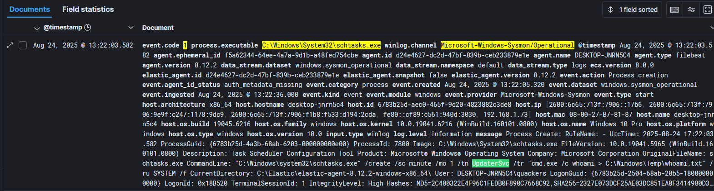

# Validation

## Goal
Confirm that scheduled task persistence (via `schtasks.exe` / PowerShell) was executed, logged, and detected in Elastic.

---

## Evidence Collected

### Host Artifacts
- `C:\Windows\Temp\whoami.txt` written every minute by schtasks.  
- `C:\Windows\Temp\whoami_ps.txt` written by PowerShell scheduled task.  
- Verified file creation timestamps aligned with scheduled intervals.

---

### Windows Event Logs
- **Sysmon Event ID 1** → Process creation:  
  - `Image: \Windows\System32\schtasks.exe`  
  - CommandLine showed creation of the `UpdaterSvc` task.  
- **Task Scheduler Operational log** → Tracked scheduled task creation events.  

---

### Elastic (Kibana Discover)
Used converted Sigma → Lucene query:

```lucene
winlog.channel:"Microsoft-Windows-Sysmon/Operational" AND event.code:1 AND process.executable:*\\schtasks.exe
```

Result: Returned hit showing execution of `schtasks.exe` tied to the simulated task.  



## Gotchas (Validation)
- **Lucene vs KQL**: Elastic defaults to KQL. Switched to Lucene for Sigma-converted queries.  
- **Wrong config file**: Agent wasn’t shipping logs until the real `elastic-agent.yml` (under Program Files) was fixed.  
- **Event source**: Sysmon Event ID 1 was the reliable capture point, not Security 4698 (which didn’t show during testing).  

---

## Outcome
- Persistence executed ✅  
- Sysmon logged ✅  
- Elastic ingested ✅  
- Sigma query matched ✅  

This closes the loop: the attack simulation → telemetry → detection → validation chain worked end-to-end.
